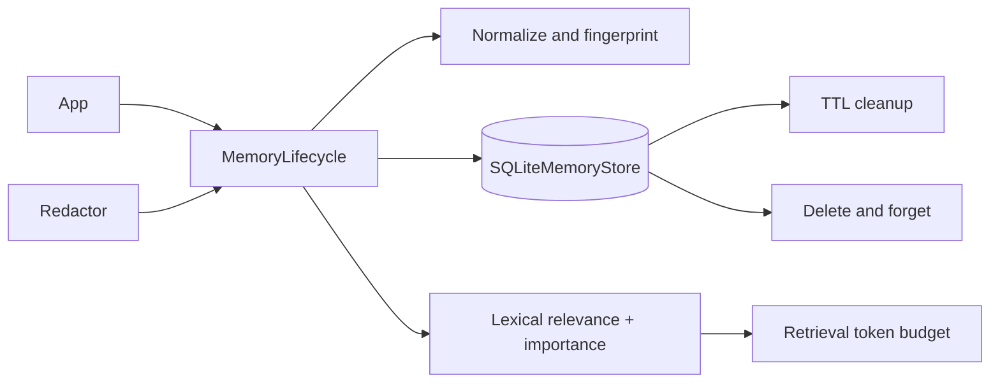
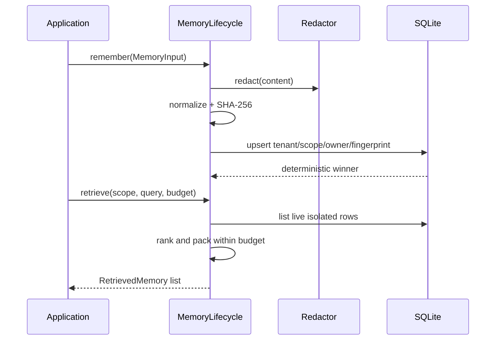

# Agent Memory Lifecycle

Agent Memory Lifecycle treats agent memory as managed application data. It persists tenant-scoped working, session, user, and semantic memories in SQLite with expiry, deduplication, deterministic conflict resolution, retrieval budgets, redaction, and forget operations.

## Problem Statement

Appending every conversation turn forever creates duplicates, privacy risk, cross-tenant exposure, and unbounded prompts. Memory needs explicit ownership, lifecycle, relevance, and deletion rules without requiring an LLM or hosted vector database.

## What This Project Solves

- four explicit memory scopes
- tenant and owner isolation in every storage lookup
- optional TTL and deterministic expiration
- normalized SHA-256 fingerprints and deduplication
- importance metadata and deterministic conflict winners
- lexical retrieval with token budgets
- delete-one and scoped forget APIs
- PII redaction before fingerprinting and persistence
- restart-safe SQLite storage

## When To Use It

Use it for local agents and services that need predictable memory semantics and modest datasets. It provides a clear base for an optional embedding adapter without making embeddings mandatory.

## Architecture / HLD



## Detailed Design / LLD



The unique database key is `(tenant, scope, owner, fingerprint)`. A duplicate replaces the stored value only when its `(importance, created_at, id)` tuple wins, making conflicts repeatable.

## Public API / API Structure

| API | Purpose |
| --- | --- |
| `MemoryScope` | Working, session, user, or semantic scope |
| `MemoryInput` / `Memory` | Validated input and persisted record |
| `MemoryLifecycle.remember` | Redact, fingerprint, and deduplicate |
| `MemoryLifecycle.retrieve` | Isolated, ranked, budgeted retrieval |
| `expire`, `delete`, `forget` | Lifecycle removal operations |
| `SQLiteMemoryStore` | Local durable store |
| `RegexRedactor` | Composable regular-expression redaction hook |

## Core Concepts

Memory is never queried without tenant, scope, and owner. Expired rows are excluded immediately and can be physically removed with `expire()`. Retrieval estimates tokens as `ceil(characters/4)`, ranks lexical overlap before importance, and skips records that would exceed the total budget.

Redaction occurs before hashing, so equivalent redacted content deduplicates and raw PII never reaches the store through this API.

## Local Prerequisites

- Python 3.11 or newer
- Git

SQLite ships with Python; no hosted service is required.

## Steps To Run

```bash
git clone https://github.com/aniket-deshkar/agent-memory-lifecycle.git
cd agent-memory-lifecycle
python -m venv .venv
python -m pip install -e ".[dev]"
pytest
```

## Configuration

Pass a SQLite path, a clock callable, and an optional redaction callable. Use `:memory:` for tests. Configure TTL on each `MemoryInput`; absence of TTL means retention until explicit deletion.

## Usage Examples

```python
store = SQLiteMemoryStore("agent-memory.sqlite")
lifecycle = MemoryLifecycle(
    store,
    redact=RegexRedactor([r"[\w.]+@[\w.]+"], "[EMAIL]"),
)
lifecycle.remember(
    MemoryInput(
        tenant_id="north",
        scope=MemoryScope.USER,
        owner_id="user-42",
        content="Prefers concise answers",
        importance=0.8,
        ttl_seconds=30 * 24 * 60 * 60,
    )
)
memories = lifecycle.retrieve("north", MemoryScope.USER, "user-42", "answer preference", 200)
```

Close the store during application shutdown.

## Testing

Run `ruff check .`, `ruff format --check .`, `pytest`, and `python -m build`. Fourteen tests cover scope and tenant isolation, TTL boundaries, physical expiry, deduplication, conflict policy, retrieval budgets, delete/forget behavior, redaction, invalid input, resource cleanup, and SQLite reopen. CI runs Python 3.11 and 3.14.

## Observability

Instrument remember, duplicate, retrieve, expire, and forget counts in the host. Record counts and durations, not memory content. Track retrieval budget utilization and expired-row cleanup volume.

## Security

Tenant ID is mandatory in storage operations, but the caller must authenticate it. Protect SQLite file permissions and backups, configure comprehensive redaction, and apply retention policy to memories without TTL. Never store credentials in memory content or metadata.

See [SECURITY.md](SECURITY.md).

## Repository Structure

```text
src/agent_memory_lifecycle/   Models, lifecycle, redaction, SQLite store
tests/                        Lifecycle and restart tests
.github/workflows/ci.yml      Python 3.11/3.14 gate
pyproject.toml                Package and tooling configuration
```

## Design Decisions / Trade-offs

- SQLite provides local durability and transactions but is not a shared distributed memory service.
- Lexical ranking is deterministic and dependency-free but less semantic than embeddings.
- Stable fingerprinting deduplicates normalized content; applications needing semantic deduplication can preprocess before `remember`.
- Budget packing skips oversized memories instead of truncating content, preserving record integrity.

## Contributing

Follow [CONTRIBUTING.md](CONTRIBUTING.md) and include isolation and deletion evidence for lifecycle changes.

## License

Apache License 2.0. See [LICENSE](LICENSE).
